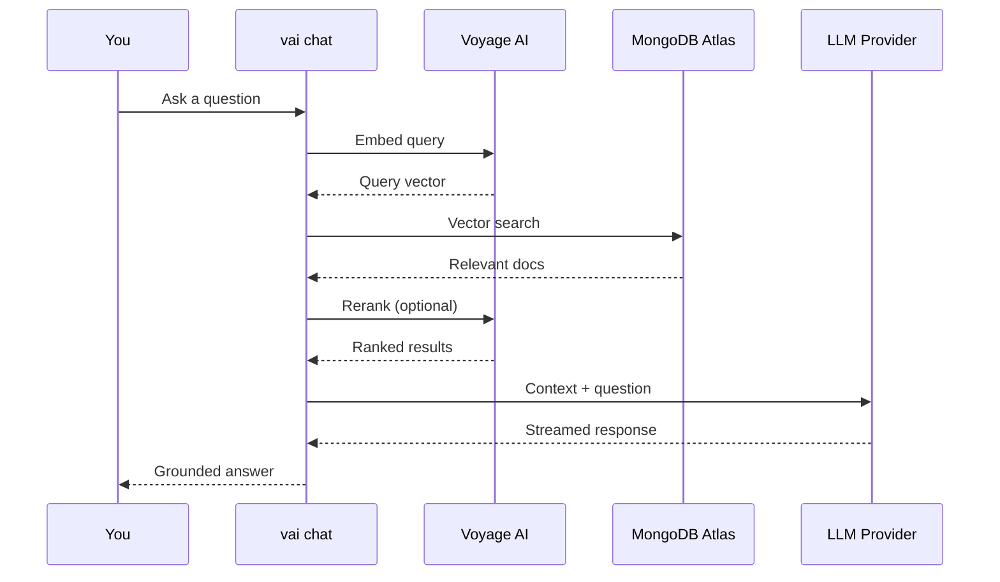

import Tabs from '@theme/Tabs';
import TabItem from '@theme/TabItem';

# vai chat

A conversational RAG interface that combines vector search retrieval with LLM-powered responses. Chat with your knowledge base using natural language.

<Tabs>
<TabItem value="cli" label="CLI" default>

## Synopsis

```bash
vai chat [options]
```

## Description

`vai chat` starts an interactive chat session that:

1. Takes your question
2. Retrieves relevant documents from MongoDB Atlas via vector search
3. Optionally reranks results for better precision
4. Sends the context + question to an LLM for a grounded response
5. Streams the response back to your terminal

Supports three LLM providers: **Anthropic** (Claude), **OpenAI** (GPT), and **Ollama** (local models). Sessions can be persisted to MongoDB for resumption.

Two modes are available:
- **Pipeline mode** (default): Fixed RAG flow, search → rerank → generate
- **Agent mode**: The LLM uses tool calls to decide when and how to search

## Options

| Flag | Description | Default |
|------|-------------|---------|
| `--db <name>` | MongoDB database name | From `.vai.json` |
| `--collection <name>` | Collection with embedded documents | From `.vai.json` |
| `--session <id>` | Resume a previous chat session | — |
| `--llm-provider <name>` | LLM provider: `anthropic`, `openai`, `ollama` | From config |
| `--llm-model <name>` | Specific LLM model | From config |
| `--llm-api-key <key>` | LLM API key | From config |
| `--llm-base-url <url>` | LLM API base URL (for Ollama) | From config |
| `--mode <mode>` | Chat mode: `pipeline` or `agent` | `pipeline` |
| `--max-context-docs <n>` | Max retrieved documents for context | `5` |
| `--max-turns <n>` | Max conversation turns before truncation | `20` |
| `--no-history` | Disable MongoDB persistence (in-memory only) | — |
| `--no-rerank` | Skip reranking step | — |
| `--no-stream` | Wait for complete response (don't stream) | — |
| `--system-prompt <text>` | Override the system prompt | — |
| `--text-field <name>` | Document text field name | `text` |
| `--filter <json>` | MongoDB pre-filter for vector search | — |
| `--estimate` | Show per-turn cost breakdown and exit | — |
| `--json` | Output JSON per turn (for scripting) | — |
| `-q, --quiet` | Suppress decorative output | — |

## Examples

### Start a chat session

```bash
vai chat --db myapp --collection docs
```

### Chat with Ollama (local)

```bash
vai chat --llm-provider ollama --llm-model llama3 --llm-base-url http://localhost:11434
```

### Agent mode with Anthropic

```bash
vai chat --mode agent --llm-provider anthropic --llm-model claude-sonnet-4-20250514
```

### Resume a previous session

```bash
vai chat --session abc123
```

### Estimate per-turn costs

```bash
vai chat --estimate
```

## Setup

Before using chat, configure your LLM provider:

```bash
# Anthropic
vai config set llm-provider anthropic
vai config set llm-api-key sk-ant-...

# OpenAI
vai config set llm-provider openai
vai config set llm-api-key sk-...

# Ollama (no API key needed)
vai config set llm-provider ollama
vai config set llm-base-url http://localhost:11434
vai config set llm-model llama3
```

Or use `vai init`, which includes chat setup in the interactive wizard.

</TabItem>
<TabItem value="playground" label="Playground">

## Using Chat in the Playground

The `vai playground` does not currently include a dedicated Chat tab. Chat is a CLI-only feature that provides an interactive terminal session with streaming responses.

### Why CLI Only?

Chat sessions are conversational and stateful, requiring real-time streaming and keyboard interaction that work naturally in the terminal. The playground focuses on discrete operations (embed, search, rerank, similarity) and visual workflow building.

### Getting Started with CLI Chat

1. Configure your LLM provider:

```bash
vai config set llm-provider anthropic
vai config set llm-api-key sk-ant-...
```

2. Start a chat session:

```bash
vai chat --db myapp --collection docs
```

3. Ask questions in natural language. vai retrieves relevant documents from your collection and generates grounded answers.

### Pipeline vs. Agent Mode

| Feature | Pipeline Mode | Agent Mode |
|---------|--------------|------------|
| **Retrieval** | Every turn: search → rerank → generate | LLM decides when to search |
| **Flexibility** | Fixed flow | LLM can search multiple times, different queries |
| **Predictability** | High | Lower (LLM-dependent) |
| **Token cost** | Consistent | Variable |
| **Requires** | Any LLM | LLM with tool-calling support |

### Supported Providers

| Provider | Models | Setup |
|----------|--------|-------|
| **Anthropic** | Claude Opus, Claude Sonnet | API key from [console.anthropic.com](https://console.anthropic.com) |
| **OpenAI** | GPT-4, GPT-4 Turbo, GPT-3.5 Turbo | API key from [platform.openai.com](https://platform.openai.com) |
| **Ollama** | Llama 3, Mistral, Phi, Gemma | Local installation, free |

</TabItem>
</Tabs>

## How It Works



## Tips

- Pipeline mode is simpler and more predictable. Agent mode gives the LLM more autonomy to search and reason.
- Use `--no-history` for quick ad-hoc questions without persisting the conversation.
- The `--filter` option lets you scope the chat to specific document categories.
- Chat settings can also be configured in `.vai.json` under the `chat` key.

## Related Commands

- [`vai query`](../rag-pipeline/query) — Single-shot retrieval (non-conversational)
- [`vai config`](../tools-and-learning/config) — Set LLM provider credentials
- [`vai init`](../project-setup/init) — Interactive project setup including chat config
