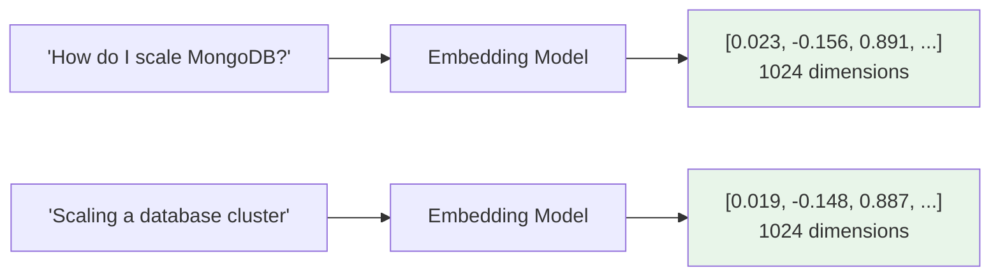

# Vector Embeddings

Vector embeddings are numerical representations of text as arrays of floating-point numbers — typically 256 to 2048 dimensions. They capture the **semantic meaning** of the input, not just keywords. Texts with similar meanings end up close together in this high-dimensional space, even if they share no words.

## How Embeddings Work

When you embed text, a neural network reads the entire input and produces a fixed-size vector. The model has been trained on massive text corpora to place semantically similar content near each other in vector space.



These two texts have very different words, but their embeddings are close together because they share the same meaning.

## Key Concepts

### Dimensions

Higher dimensions capture more nuance but cost more to store and search. Voyage 4 models default to **1024 dimensions** but support 256, 512, 1024, and 2048 via **Matryoshka representation learning** — you can truncate embeddings to fewer dimensions without retraining.

```bash
# Default 1024 dimensions
vai embed "hello world"

# Reduced dimensions for faster search
vai embed "hello world" --dimensions 256
```

### Input Types

When embedding for retrieval, use `--input-type query` for search queries and `--input-type document` for corpus text. The model prepends different internal prompts for each, optimizing the embedding for asymmetric retrieval.

```bash
# For documents you're storing
vai embed --file article.txt --input-type document

# For search queries
vai embed "How do I deploy?" --input-type query
```

### Quantization

Embeddings can be output as `int8`, `uint8`, `binary`, or `ubinary` instead of `float` to reduce storage size with minimal quality loss:

```bash
vai embed "hello" --output-dtype int8
```

## Shared Embedding Space

All Voyage 4 series models (`voyage-4-large`, `voyage-4`, `voyage-4-lite`) share the same embedding space. This means you can embed documents with a cheaper model and queries with a more expensive one — or vice versa — for cost optimization without quality loss.

```bash
# Embed documents cheaply
vai store --text "..." --model voyage-4-lite --db myapp --collection docs

# Query with the best model
vai search --query "..." --model voyage-4-large --db myapp --collection docs
```

## Real-World Analogy

Think of embeddings like GPS coordinates. Two restaurants might have completely different names and menus, but if they're both in the same neighborhood, their coordinates are close. Similarly, "How to scale MongoDB" and "Database cluster expansion" have different words but similar "coordinates" in embedding space.

## Try It

```bash
# Generate an embedding
vai embed "What is vector search?"

# Compare similarity between texts
vai similarity "cat" "dog"
vai similarity "cat" "database"

# Learn more about embeddings
vai explain embeddings
```

## Further Reading

- [Cosine Similarity](./cosine-similarity) — How similarity is measured
- [Input Types](./input-types) — Query vs. document input types
- [Quantization](./quantization) — Reducing embedding size
- [Shared Embedding Space](./shared-embedding-space) — Cross-model compatibility
