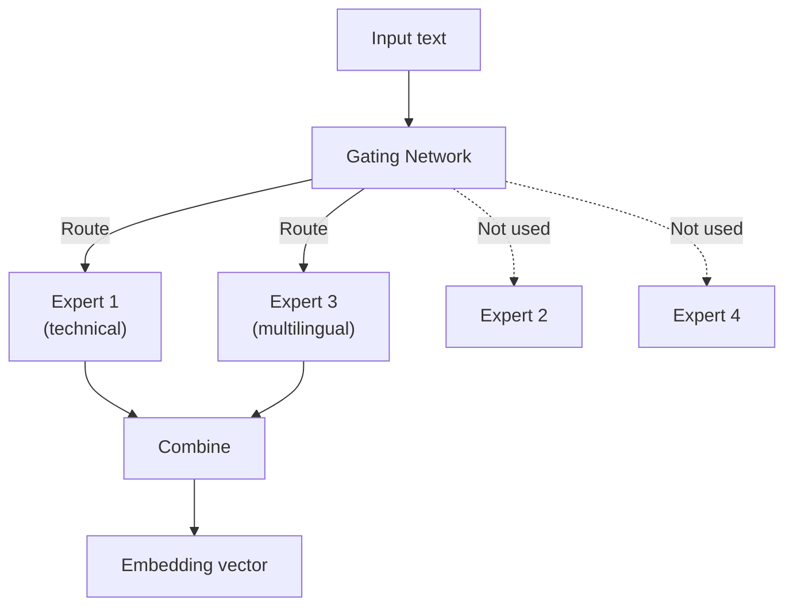

# Mixture of Experts (MoE)

Mixture of Experts is a neural network architecture where multiple specialized "expert" sub-networks handle different types of input. A gating network routes each input to the most relevant experts, activating only a fraction of the model's parameters per inference.

## How MoE Differs from Dense Models

**Dense models** (like `voyage-4` and `voyage-4-lite`) activate all parameters for every input. This is simple but means larger models = proportionally more compute.

**MoE models** (like `voyage-4-large`) have many expert sub-networks but only activate a subset per input. This allows the model to have more total knowledge (parameters) without proportionally increasing inference cost.



## Why It Matters for Embeddings

`voyage-4-large` uses MoE architecture, which is why it achieves the highest quality (71.41 RTEB score) while keeping per-token cost at $0.12/1M — comparable to much smaller models. Different experts specialize in different content types (code, legal, multilingual), giving the model broad expertise.

## Voyage 4 Model Architectures

| Model | Architecture | RTEB Score | Price |
|-------|-------------|------------|-------|
| `voyage-4-large` | MoE | 71.41 | $0.12/1M |
| `voyage-4` | Dense | 70.07 | $0.06/1M |
| `voyage-4-lite` | Dense | 68.10 | $0.02/1M |

## Try It

```bash
# Compare quality across architectures
vai benchmark embed --models voyage-4-large,voyage-4,voyage-4-lite

# Learn more
vai explain moe
```

## Further Reading

- [Embeddings](./embeddings) — Embedding fundamentals
- [Shared Embedding Space](./shared-embedding-space) — Why MoE and dense models are compatible
