# Multimodal Embeddings

Multimodal embeddings place different content types — text, images, and video frames — into the **same vector space**. This enables cross-modal search: finding images with text queries, or finding text documents related to an image.

## How It Works

A multimodal embedding model processes different input types through specialized encoders, then maps them into a shared embedding space where similarity is meaningful across modalities.

```mermaid
flowchart LR
    T["Text: 'sunset over ocean'"] --> ME["Multimodal<br/>Encoder"]
    I["Image: 🌅"] --> ME
    ME --> V1["[0.23, -0.15, ...]"]
    ME --> V2["[0.21, -0.17, ...]"]
    
    V1 -.-> |"High similarity"| V2
```

## Voyage AI Multimodal Model

Voyage AI offers `voyage-multimodal-3.5` which supports text, images, and video:

| Feature | Details |
|---------|---------|
| **Model** | `voyage-multimodal-3.5` |
| **Inputs** | Text, images, video frames |
| **Context** | 32K tokens |
| **Dimensions** | 1024 (default), 256, 512, 2048 |
| **Pricing** | $0.12/M tokens + $0.60/B pixels |

## Use Cases

- **Visual search**: Find products by describing them in text
- **Content discovery**: Find articles related to an uploaded image
- **Video search**: Search video content using natural language queries
- **Mixed collections**: Search across documents that contain both text and images

## Further Reading

- [Cross-Modal Search](./cross-modal-search) — Searching across modalities
- [Modality Gap](./modality-gap) — Understanding cross-modal distances
- [Multimodal RAG](./multimodal-rag) — RAG with mixed content types
