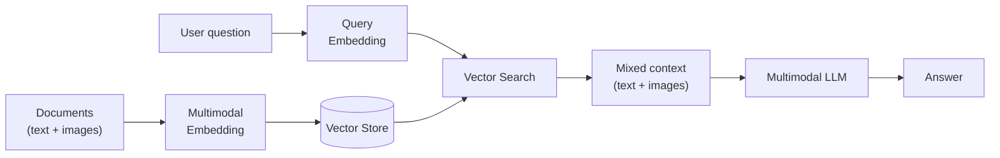

# Multimodal RAG

Multimodal RAG extends the retrieval-augmented generation pattern to handle mixed content: text documents with embedded images, standalone images, and video content. Instead of retrieving only text chunks, the system retrieves the most relevant content regardless of modality.

## The Pipeline

## Key Differences from Text RAG

| Aspect | Text RAG | Multimodal RAG |
|--------|----------|----------------|
| **Embedding model** | Text-only (voyage-4-large) | Multimodal (voyage-multimodal-3.5) |
| **Chunk types** | Text chunks | Text chunks + image regions + video frames |
| **LLM** | Text LLM | Multimodal LLM (GPT-4V, Claude 3, etc.) |
| **Context** | Text passages | Text + images in the prompt |

## Use Cases

- **Technical documentation** with diagrams — search finds both the text explanation and the relevant diagram
- **Product catalogs** — search by description, retrieve product images and specs
- **Medical records** — find relevant X-rays and clinical notes together
- **Educational content** — retrieve relevant slides, figures, and lecture text

## Considerations

- Multimodal embedding costs include both token-based (text) and pixel-based (image) pricing
- The [modality gap](./modality-gap) means cross-modal scores are lower than within-modality scores
- Not all LLMs can process mixed text+image context — use a multimodal LLM for generation

## Further Reading

- [Multimodal Embeddings](./multimodal-embeddings) — How multimodal vectors work
- [RAG](../rag) — Text-only RAG fundamentals
- [Cross-Modal Search](./cross-modal-search) — Searching across modalities
