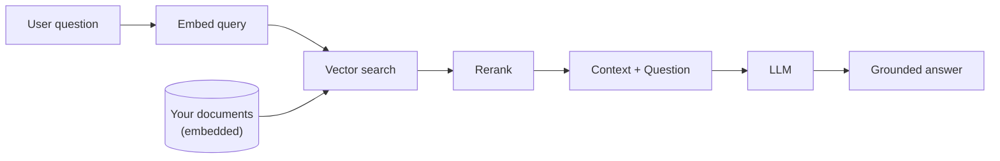

# Retrieval-Augmented Generation (RAG)

RAG is a pattern that combines **retrieval** (finding relevant documents) with **generation** (producing an answer using an LLM). Instead of relying solely on the LLM's training data, RAG grounds responses in your actual documents — reducing hallucinations and keeping answers current.

## The RAG Pipeline



1. **Chunk** — Split documents into embedding-sized pieces
2. **Embed** — Generate vector embeddings for each chunk
3. **Store** — Save embeddings in a vector database (MongoDB Atlas)
4. **Search** — When a question comes in, find the most relevant chunks
5. **Rerank** — Re-score candidates for higher precision
6. **Generate** — Send the top chunks + question to an LLM for a grounded answer

## Why RAG?

| Problem | RAG Solution |
|---------|-------------|
| LLM training data is stale | Retrieves from your current documents |
| LLM hallucinates facts | Grounds answers in real source material |
| LLM doesn't know your data | Searches your private knowledge base |
| Fine-tuning is expensive | No model training required — just index your docs |

## RAG with vai

vai handles the entire RAG pipeline:

```bash
# Step 1: Ingest documents (chunk → embed → store)
vai pipeline ./docs/ --db myapp --collection knowledge --create-index

# Step 2: Query with two-stage retrieval
vai query "How do I configure authentication?"

# Step 3: Chat with your knowledge base
vai chat --db myapp --collection knowledge
```

Or do it all in one shot with `vai chat`, which combines retrieval and generation into a conversational interface.

## Real-World Analogy

RAG is like a student taking an open-book exam. The LLM is the student (smart but might misremember details), and your document collection is the book. Instead of answering from memory alone, the student looks up the relevant pages first, then writes an answer grounded in the actual text.

## Key Considerations

- **Chunk size matters** — Too large and you include irrelevant context; too small and you lose coherence. vai defaults to 512 characters with 50-character overlap.
- **Reranking improves quality** — Vector search finds candidates; reranking picks the best ones. Use `vai query` for automatic two-stage retrieval.
- **Model choice affects quality and cost** — Use `voyage-4-large` for best quality, `voyage-4-lite` for budget, or asymmetric retrieval for the best of both.

## Further Reading

- [Two-Stage Retrieval](./two-stage-retrieval) — The search + rerank pattern
- [Embeddings](./embeddings) — How text becomes vectors
- [Reranking](./reranking) — Cross-encoder re-scoring
