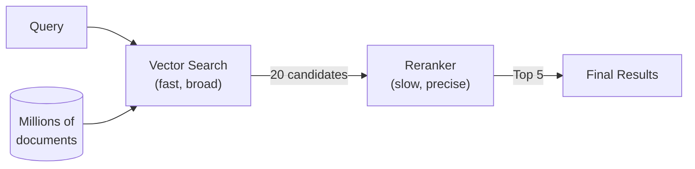

# Reranking

Reranking is the process of re-scoring a set of candidate documents against a query to improve precision. It's the "second stage" of two-stage retrieval.

## Why Reranking?

Embedding models encode queries and documents **independently** — each text gets its own vector without seeing the other. This is fast (embed once, search many) but can miss subtle relevance signals.

A reranker uses **cross-attention** — it reads the query and each document **together**, producing a much more accurate relevance score. The tradeoff: it's slower (one inference per document), so you use it on a small candidate set, not your entire corpus.



## How It Works

1. **Stage 1 — Vector Search**: Embed the query, find the top 20-100 candidates by cosine similarity. Fast but approximate.
2. **Stage 2 — Reranking**: Send the query + each candidate to a cross-encoder model. It reads both together and outputs a precision relevance score. Return the top K.

The combination gives you the speed of embedding search with the precision of cross-attention.

## Reranking with vai

```bash
# Automatic two-stage retrieval
vai query "How do I configure auth?" --limit 20 --top-k 5

# Manual reranking
vai rerank --query "How do I configure auth?" \
  --documents-file candidates.json --top-k 5

# Disable reranking for speed
vai query "quick lookup" --no-rerank
```

## Voyage AI Reranking Models

| Model | Context | Price | Best For |
|-------|---------|-------|----------|
| `rerank-2.5` | 32K | $0.05/1M tokens | Best quality |
| `rerank-2.5-lite` | 32K | $0.02/1M tokens | Fast, cost-effective |

## Real-World Analogy

Vector search is like a librarian quickly pulling 20 books from the shelf that seem relevant to your question. Reranking is like actually reading the introduction of each book and sorting them by how well they actually answer your specific question.

## When to Use Reranking

- **Always use it** when precision matters (production search, customer-facing)
- **Skip it** for exploratory search, low-latency requirements, or when you only need rough results
- **Monitor the cost**: reranking adds tokens (query + all candidates) per request

## Further Reading

- [Two-Stage Retrieval](./two-stage-retrieval) — The full pattern
- [Vector Search](./vector-search) — The first stage
- [Cosine Similarity](./cosine-similarity) — How embedding similarity works
