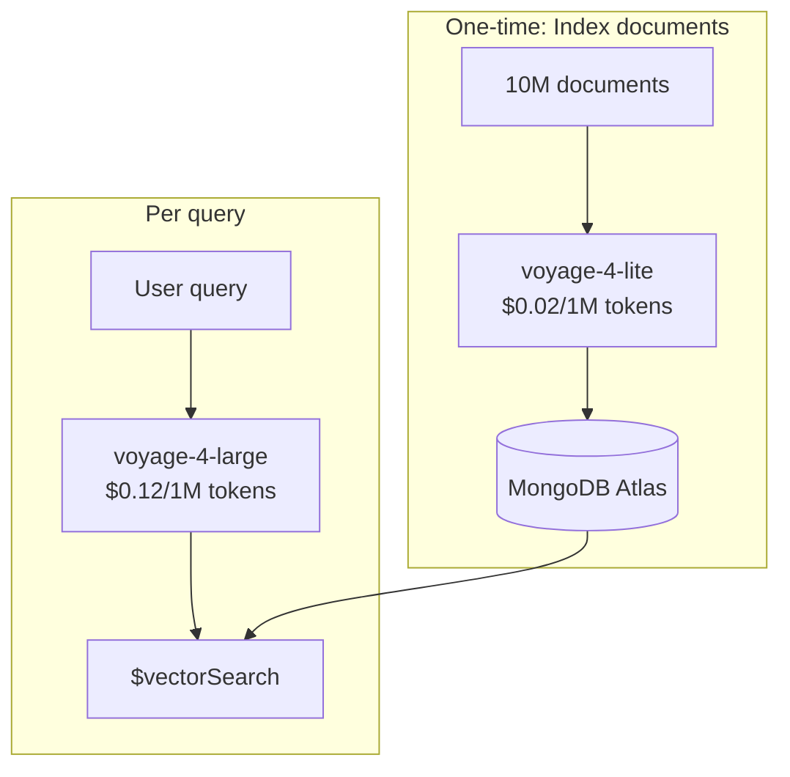

# Shared Embedding Space

All Voyage 4 series models (`voyage-4-large`, `voyage-4`, `voyage-4-lite`, `voyage-4-nano`) share the same embedding space. This means vectors from different models are directly comparable — you can embed documents with one model and queries with another.

## Why This Matters

The shared embedding space enables **asymmetric retrieval** — a cost optimization strategy:

- Embed your document **corpus once** with a cheaper model (e.g., `voyage-4-lite` at $0.02/1M tokens)
- Embed **queries** with a higher-quality model (e.g., `voyage-4-large` at $0.12/1M tokens)

Since queries are short and infrequent compared to your entire corpus, this dramatically reduces costs while maintaining search quality.



## Cost Savings

```bash
# See the savings for your workload
vai estimate --docs 1M --queries 10M --months 12

# The numbers:
# Symmetric (voyage-4-large for everything): ~$180/year
# Asymmetric (lite for docs, large for queries): ~$38/year
# That's ~79% savings
```

## How It Works

Voyage 4 models are trained to place text in the same semantic region regardless of which model in the family generates the embedding. A document embedded with `voyage-4-lite` occupies nearly the same position as it would with `voyage-4-large`.

The practical implication: cosine similarity between a `voyage-4-large` query vector and a `voyage-4-lite` document vector is meaningful and produces good retrieval results.

## Try It

```bash
# Benchmark cross-model similarity
vai benchmark asymmetric

# Compare costs
vai estimate --doc-model voyage-4-lite --query-model voyage-4-large

# Learn more
vai explain shared-space
```

## Further Reading

- [Embeddings](./embeddings) — How embeddings work
- [Input Types](./input-types) — Query vs. document embedding
- [`vai estimate`](/docs/commands/rag-pipeline/estimate) — Cost comparison tool
