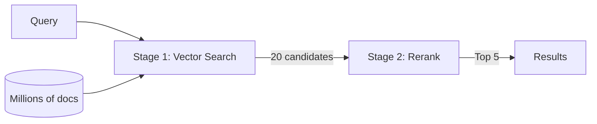

# Two-Stage Retrieval

Two-stage retrieval combines **fast vector search** (stage 1) with **precise reranking** (stage 2) to deliver high-quality results efficiently. It's the gold standard for production search systems.

## The Pattern



**Stage 1 — Recall**: Cast a wide net. Vector search retrieves 20-100 candidates quickly using ANN. Fast but approximate.

**Stage 2 — Precision**: Narrow the field. A cross-encoder reranker reads each candidate alongside the query, producing precise relevance scores. Return the top K.

## Why Two Stages?

Neither stage alone is sufficient:

- **Vector search only**: Fast, but embedding models encode query and document independently — they can miss nuanced relevance.
- **Reranking only**: Precise, but too slow to run on your entire corpus (one inference per document).

Together, you get the speed of embeddings with the precision of cross-attention.

## Two-Stage Retrieval with vai

```bash
# Automatic: vai query does both stages
vai query "How do I configure replica sets?"

# Control the pipeline
vai query "scaling" --limit 50 --top-k 10 --rerank-model rerank-2.5

# Skip stage 2 when you don't need it
vai query "quick lookup" --no-rerank
```

## Tuning Parameters

| Parameter | Effect |
|-----------|--------|
| `--limit` (stage 1) | More candidates = better recall, higher reranking cost |
| `--top-k` (stage 2) | More final results = broader coverage |
| `--num-candidates` | ANN search depth — higher = better recall |
| `--rerank-model` | `rerank-2.5` (quality) vs. `rerank-2.5-lite` (speed) |

A good starting point: `--limit 20 --top-k 5`. Increase `--limit` if you're missing relevant results; decrease if reranking cost is too high.

## Further Reading

- [Reranking](./reranking) — How cross-encoder rerankers work
- [Vector Search](./vector-search) — The first stage in detail
- [RAG](./rag) — Two-stage retrieval in the context of RAG
