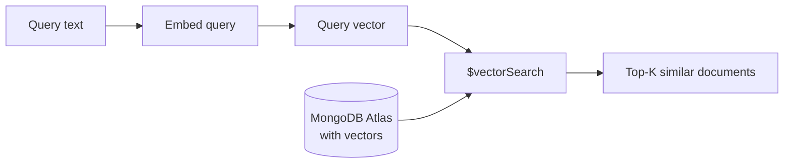

# Vector Search

Vector search (also called similarity search or semantic search) finds documents whose embeddings are closest to a query embedding in high-dimensional space. Unlike keyword search, it understands meaning — a query for "scaling databases" finds documents about "horizontal sharding" even without shared keywords.

## How It Works



1. **Embed the query** — Convert your search text into a vector using the same (or compatible) model used for documents
2. **ANN search** — MongoDB Atlas uses an approximate nearest neighbor (ANN) algorithm (HNSW) to efficiently find the closest vectors
3. **Return results** — Documents are returned ranked by similarity score

## Exact vs. Approximate Search

**Exact search** (brute force) compares the query against every document. It's accurate but slow — O(n) for n documents.

**Approximate nearest neighbor (ANN)** uses index structures like HNSW (Hierarchical Navigable Small World) to find near-optimal results in milliseconds, even with millions of documents. The tradeoff: a tiny chance of missing the absolute best match, which is almost never noticeable in practice.

MongoDB Atlas Vector Search uses HNSW under the hood. The `numCandidates` parameter controls accuracy vs. speed — higher values check more candidates for better recall.

## Similarity Functions

| Function | Description | When to Use |
|----------|-------------|-------------|
| **Cosine** | Measures angle between vectors | Default for most embedding models |
| **Dot Product** | Measures directional alignment + magnitude | When vectors are normalized |
| **Euclidean** | Measures straight-line distance | Less common for text embeddings |

vai uses cosine similarity by default, which is what Voyage AI models are optimized for.

## Pre-filtering

MongoDB Atlas Vector Search supports pre-filtering — narrowing the search space before comparing vectors:

```bash
vai search --query "authentication" --db myapp --collection docs \
  --filter '{"metadata.category": "security"}'
```

This runs the vector search only on documents matching the filter, combining metadata-based and semantic search.

## vai Commands for Vector Search

```bash
# Single-stage vector search
vai search --query "How do I deploy?" --db myapp --collection docs

# Two-stage: vector search + reranking
vai query "How do I deploy?"

# Create a vector search index
vai index create --db myapp --collection docs --field embedding
```

## Key Parameters

- **`limit`** — Number of results to return (default: 10)
- **`numCandidates`** — ANN candidates to consider (default: `limit × 15`). Higher = better recall, slower search.
- **`minScore`** — Filter out low-confidence results

## Further Reading

- [Cosine Similarity](./cosine-similarity) — The default similarity metric
- [Two-Stage Retrieval](./two-stage-retrieval) — Why vector search alone isn't enough
- [Reranking](./reranking) — The second stage for higher precision
