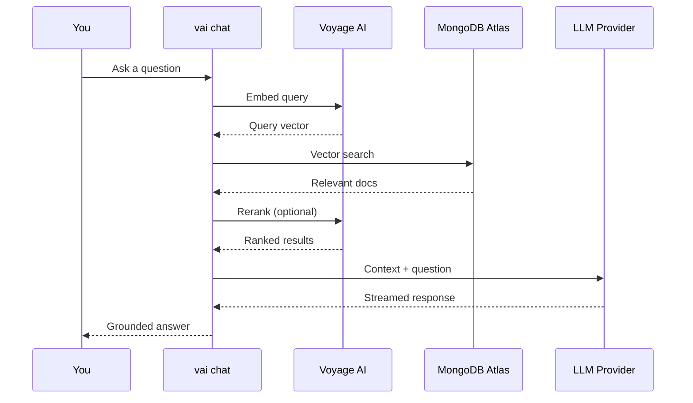

# Chat Guide

`vai chat` provides a conversational RAG interface — ask questions about your documents and get grounded answers from an LLM.

## How It Works



## Two Modes

### Pipeline Mode (Default)

Fixed RAG flow for every turn: search → rerank → generate. Predictable and efficient.

```bash
vai chat --db myapp --collection docs --mode pipeline
```

### Agent Mode

The LLM uses tool calls to decide when to search, which collection to query, and how to combine results. More flexible but less predictable.

```bash
vai chat --db myapp --collection docs --mode agent
```

## Supported LLM Providers

| Provider | Models | Setup |
|----------|--------|-------|
| **Anthropic** | Claude 4, Claude Sonnet | API key required |
| **OpenAI** | GPT-4, GPT-3.5 | API key required |
| **Ollama** | Llama 3, Mistral, etc. | Local installation |

## Quick Start

```bash
# 1. Configure LLM provider
vai config set llm-provider anthropic
vai config set llm-api-key sk-ant-...

# 2. Start chatting
vai chat --db myapp --collection docs
```

## Next Steps

- [Setup](./setup) — Configure LLM providers
- [Providers](./providers) — Provider-specific details
- [Agent Mode](./agent-mode) — Advanced tool-calling mode
