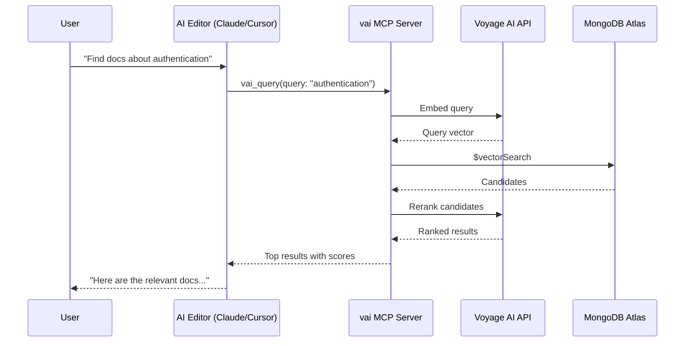

# MCP Server Guide

vai includes a Model Context Protocol (MCP) server that exposes embedding, search, reranking, and knowledge management tools to AI-powered editors like Claude Desktop, Cursor, Windsurf, and VS Code.

## What is MCP?

The [Model Context Protocol](https://modelcontextprotocol.io) is a standard for connecting AI assistants to external tools. When you install vai as an MCP server, your AI editor can:

- **Search your knowledge base** with natural language
- **Embed and store documents** directly from the editor
- **Compare text similarity** inline
- **Explain RAG concepts** on demand
- **List models and collections** for context

## Quick Setup

```bash
# Install into all supported AI tools
vai mcp install all

# Verify installation
vai mcp status
```

That's it. Restart your AI tool and vai's 11 tools will be available.

## Supported Tools

| Tool | What It Does |
|------|-------------|
| `vai_query` | Full RAG query (embed → search → rerank) |
| `vai_search` | Vector search without reranking |
| `vai_embed` | Generate an embedding |
| `vai_similarity` | Compare two texts |
| `vai_ingest` | Chunk, embed, and store a document |
| `vai_collections` | List database collections |
| `vai_models` | List available models |
| `vai_topics` | Browse educational topics |
| `vai_explain` | Get concept explanations |

## How It Works



## Next Steps

- [Automatic Setup](./automatic-setup) — Detailed installation guide
- [Manual Configuration](./manual-configuration) — Configure by hand
- [Transport Modes](./transport-modes) — stdio vs. HTTP
- [Authentication](./authentication) — Securing the HTTP transport
- [Testing](./testing) — Verify your setup works
- [n8n Integration](/docs/guides/n8n-integration) — Use vai tools in n8n workflows
