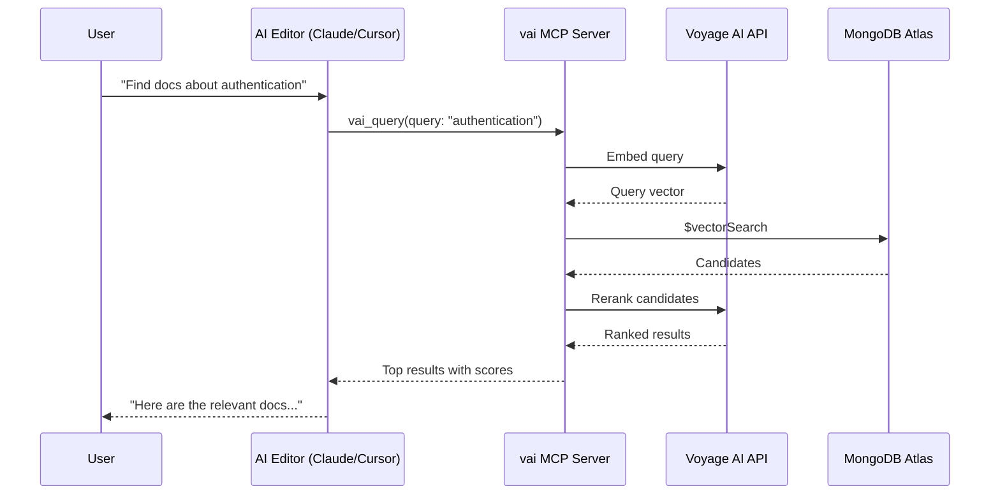

import RobotMomentCallout from '@site/src/components/RobotMomentCallout';

# MCP Server Guide

vai includes a Model Context Protocol (MCP) server that exposes **22 tools** to AI-powered editors like Claude Desktop, Cursor, Windsurf, and VS Code — covering retrieval, embeddings (text and multimodal), ingestion, workspace indexing, a dedicated semantic **code index**, cost estimation, and workflow authoring.

<RobotMomentCallout
  pose="thinking"
  eyebrow="Editors and agents"
  title="MCP is how assistants reach Atlas and Voyage through vai"
  ctaLabel="Automatic setup walkthrough"
  ctaTo="/docs/guides/mcp-server/automatic-setup"
>
  <p>
    Tools are grouped by job: retrieval, embeddings, ingest, workspace and
    code-index search, authoring. Pick the install path for your editor, then
    use the tool list when you need exact parameter shapes.
  </p>
</RobotMomentCallout>

## What is MCP?

The [Model Context Protocol](https://modelcontextprotocol.io) is a standard for connecting AI assistants to external tools. When you install vai as an MCP server, your AI editor can:

- **Search your knowledge base** with natural language (`vai_query`, `vai_search`)
- **Rerank** candidate texts (`vai_rerank`)
- **Embed** text or **multimodal** inputs (`vai_embed`, `vai_multimodal_embed`)
- **Index and search code** via either the workspace tools or the dedicated code-index pipeline
- **Chunk, embed, and store** documents (`vai_ingest`)
- **Explain RAG concepts** and **estimate costs** (`vai_explain`, `vai_estimate`)
- **Generate or validate** vai workflows (`vai_generate_workflow`, `vai_validate_workflow`)

## Quick Setup

```bash
# Install into all supported AI tools
vai mcp install all

# Verify installation
vai mcp status
```

Restart your AI tool after installing. All **22 tools** should appear in the MCP tool list.

## Supported tools

:::tip Workspace vs code index
**`vai_search_code`** searches data indexed with **`vai_index_workspace`**. **`vai_code_search`** searches data indexed with **`vai_code_index`** (same pipeline as [`vai code-search`](/docs/commands/data-management/code-search)). Use the pair that matches how the collection was built.
:::

### Retrieval

| Tool | What it does |
|------|----------------|
| `vai_query` | Embed → MongoDB `$vectorSearch` → optional rerank |
| `vai_search` | Vector search only (no rerank) |
| `vai_rerank` | Rerank provided strings against a query |

### Embedding

| Tool | What it does |
|------|----------------|
| `vai_embed` | Text embedding vector |
| `vai_similarity` | Cosine similarity between two texts |
| `vai_multimodal_embed` | Embeddings for text and/or image/video payloads |

### Management

| Tool | What it does |
|------|----------------|
| `vai_collections` | List collections and vector index info |
| `vai_models` | List Voyage models |

### Utility

| Tool | What it does |
|------|----------------|
| `vai_topics` | List explainer topics |
| `vai_explain` | Long-form topic explanation |
| `vai_estimate` | Cost estimate for embed/query scale |

### Ingest

| Tool | What it does |
|------|----------------|
| `vai_ingest` | Chunk, embed, store one document |

### Workspace

| Tool | What it does |
|------|----------------|
| `vai_index_workspace` | Index a local tree (`code` / `docs` / `config` / `all`) |
| `vai_search_code` | Semantic search on workspace index |
| `vai_explain_code` | Explain snippet using retrieved workspace context |

### Code search (MongoDB code index)

| Tool | What it does |
|------|----------------|
| `vai_code_index` | Index path or GitHub repo for semantic code search |
| `vai_code_search` | Query indexed code by meaning |
| `vai_code_query` | RAG-style Q&A over indexed code |
| `vai_code_find_similar` | Nearest neighbors for a code snippet |
| `vai_code_status` | Index stats and vector index status |

### Authoring

| Tool | What it does |
|------|----------------|
| `vai_generate_workflow` | NL → vai workflow JSON |
| `vai_validate_workflow` | Validate workflow structure and dependencies |

## How it works


```mermaid
sequenceDiagram
    participant User
    participant AI as AI Editor (Claude/Cursor)
    participant MCP as vai MCP Server
    participant API as Voyage AI API
    participant DB as MongoDB Atlas

    User->>AI: "Find docs about authentication"
    AI->>MCP: vai_query(query: "authentication")
    MCP->>API: Embed query
    API-->>MCP: Query vector
    MCP->>DB: $vectorSearch
    DB-->>MCP: Candidates
    MCP->>API: Rerank candidates
    API-->>MCP: Ranked results
    MCP-->>AI: Top results with scores
    AI-->>User: "Here are the relevant docs..."
```

## Next steps

- [Automatic Setup](./automatic-setup) — Detailed installation guide
- [Manual Configuration](./manual-configuration) — Configure by hand
- [Transport Modes](./transport-modes) — stdio vs. HTTP
- [Authentication](./authentication) — Securing the HTTP transport
- [Testing](./testing) — Verify your setup works
- [MCP tools reference](/docs/api-reference/mcp-tools) — Full parameter tables
- [n8n Integration](/docs/guides/n8n-integration) — Use vai tools in n8n workflows
