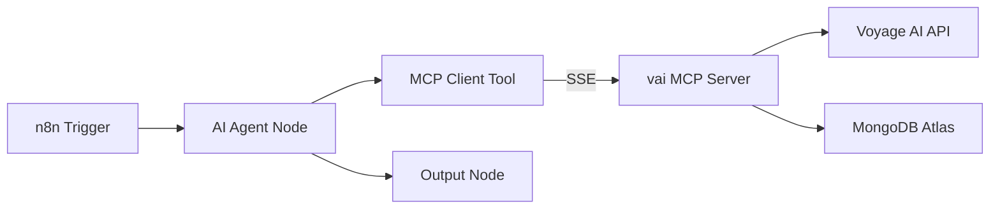
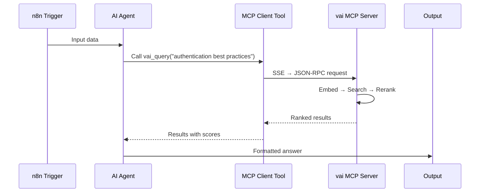

# n8n Integration

[n8n](https://n8n.io) is an open-source workflow automation platform. With vai's MCP server and n8n's built-in **MCP Client Tool** node, you can add semantic search, embeddings, and RAG to any n8n workflow.

## Architecture



n8n's AI Agent node connects to vai via the MCP Client Tool, which uses **SSE transport** to communicate. The AI agent can dynamically choose which vai tools to call based on the workflow context.

## Prerequisites

- **vai** installed and configured (`vai ping` should succeed)
- **MongoDB Atlas** with a vector search index (or run `vai init` to set one up)
- **n8n** running (self-hosted or cloud)
- A Voyage AI API key configured in vai (`vai config set apiKey <key>`)

## Step 1: Generate an API key

```bash
vai mcp generate-key
```

Save the output — you'll need it for n8n. The key looks like:

```
vai-mcp-key-a1b2c3d4e5f6...
```

## Step 2: Start the MCP server with SSE

```bash
vai mcp --transport http --port 3100 --sse
```

You should see:

```
vai MCP server v1.26.1 running on http://127.0.0.1:3100
  Transports: Streamable HTTP (POST /mcp), SSE (GET /sse)
```

:::tip Production deployment
For persistent operation, use a process manager:

```bash
# pm2
pm2 start "vai mcp --transport http --port 3100 --sse" --name vai-mcp

# Or systemd, Docker, etc.
```
:::

## Step 3: Verify the server

```bash
# Health check
curl http://localhost:3100/health

# Test SSE connection (should stream events)
curl -N http://localhost:3100/sse
```

The health endpoint returns:

```json
{
  "status": "ok",
  "version": "1.26.1",
  "uptime": 42,
  "voyageAi": "configured",
  "mongodb": "configured"
}
```

## Step 4: Configure n8n

### 4a. Create credentials

1. In n8n, go to **Credentials** → **Add Credential**
2. Search for **Header Auth**
3. Configure:
   - **Name**: `vai MCP`
   - **Header Name**: `Authorization`
   - **Header Value**: `Bearer vai-mcp-key-a1b2c3d4...` (your key from Step 1)

### 4b. Build your workflow

1. Add a **Trigger** node (Webhook, Cron, etc.)
2. Add an **AI Agent** node
   - Set your LLM (OpenAI, Anthropic, etc.)
   - In the system message, describe what the agent should do with vai's tools
3. Add an **MCP Client Tool** sub-node to the AI Agent
   - **SSE Endpoint**: `http://localhost:3100/sse` (or your server's address)
   - **Authentication**: Header Auth → select the `vai MCP` credential
4. n8n auto-discovers all 11 vai tools
5. Add an **Output** node (Slack, Email, HTTP Response, etc.)



## Available Tools

Once connected, the AI agent can call any of vai's 11 MCP tools:

### Retrieval

| Tool | Use case |
|------|----------|
| `vai_query` | Full RAG pipeline — embed query, vector search, rerank results |
| `vai_search` | Fast vector search without reranking |
| `vai_rerank` | Reorder documents by relevance to a query |

### Embedding

| Tool | Use case |
|------|----------|
| `vai_embed` | Generate a vector embedding for text |
| `vai_similarity` | Compare two texts semantically (cosine similarity) |

### Data Management

| Tool | Use case |
|------|----------|
| `vai_ingest` | Chunk, embed, and store a document in MongoDB |
| `vai_collections` | List available collections and their indexes |

### Utility

| Tool | Use case |
|------|----------|
| `vai_models` | List Voyage AI models with pricing and capabilities |
| `vai_estimate` | Estimate costs for embedding operations at scale |
| `vai_topics` | Browse available educational topics |
| `vai_explain` | Get detailed explanations of RAG/embedding concepts |

## Example Workflows

### Semantic Support Ticket Router

Route incoming support tickets to the right team based on content similarity.

**Nodes**: Webhook → AI Agent + MCP Client Tool → Switch → Slack channels

**Agent system prompt**:
```
You route support tickets. Use vai_search to find the most similar category
in the "support-categories" collection. Return ONLY the category name:
billing, technical, account, or general.
```

**How it works**:
1. Webhook receives a new ticket
2. AI agent calls `vai_search` against your categories collection
3. Switch node routes to the matching Slack channel

### Document Ingestion Pipeline

Automatically index new documents as they're added to Google Drive.

**Nodes**: Google Drive Trigger → Extract Text → AI Agent + MCP Client Tool → Slack

**Agent system prompt**:
```
You ingest documents into the knowledge base. Use vai_ingest to store
the provided text in the "company-docs" collection. Report how many
chunks were created.
```

### Daily Q&A Digest

Answer a set of questions from a spreadsheet every morning.

**Nodes**: Cron (daily 9am) → Google Sheets (read questions) → Loop → AI Agent + MCP Client Tool → Google Sheets (write answers) → Email summary

**Agent system prompt**:
```
Answer the question using vai_query against the "knowledge-base" collection.
Be concise — 2-3 sentences max. Include the source document if available.
```

### Content Deduplication

Check incoming content against existing documents before ingesting.

**Nodes**: Webhook → AI Agent + MCP Client Tool → IF (duplicate?) → vai_ingest or skip

**Agent system prompt**:
```
Check if this content already exists. Use vai_search with the first 200 words
as the query against the "articles" collection. If the top result has a
similarity score above 0.92, respond with "DUPLICATE". Otherwise, use
vai_ingest to store the new content and respond with "INGESTED".
```

### Multi-Collection Research

Search across multiple knowledge bases to answer complex questions.

**Nodes**: Webhook → AI Agent + MCP Client Tool → HTTP Response

**Agent system prompt**:
```
You are a research assistant. First use vai_collections to see what knowledge
bases are available. Then use vai_query on the most relevant collection(s) to
answer the user's question. Cite your sources.
```

## Network Configuration

### Same machine (development)

```
n8n → http://localhost:3100/sse → vai MCP server
```

### Docker network

```yaml
# docker-compose.yml
services:
  n8n:
    image: n8nio/n8n
    ports:
      - "5678:5678"
  vai-mcp:
    image: node:22
    command: npx voyageai-cli mcp --transport http --port 3100 --sse --host 0.0.0.0
    environment:
      - VOYAGE_API_KEY=${VOYAGE_API_KEY}
      - MONGODB_URI=${MONGODB_URI}
      - VAI_MCP_SERVER_KEY=${VAI_MCP_KEY}
    ports:
      - "3100:3100"
```

n8n SSE endpoint: `http://vai-mcp:3100/sse`

### Reverse proxy (remote access)

```nginx
# nginx.conf
server {
    listen 443 ssl;
    server_name mcp.example.com;

    location / {
        proxy_pass http://127.0.0.1:3100;
        proxy_http_version 1.1;
        proxy_set_header Connection '';
        proxy_buffering off;
        proxy_cache off;
        chunked_transfer_encoding off;
    }
}
```

:::warning
SSE requires `proxy_buffering off` and no chunked encoding interference. Without these settings, events will be delayed or dropped.
:::

n8n SSE endpoint: `https://mcp.example.com/sse`

## Monitoring

### Health check

```bash
curl http://localhost:3100/health
```

### Active SSE sessions

```bash
curl http://localhost:3100/health/sse
# {"sseSessions": 3}
```

### Verbose logging

Start the server with `--verbose` to log all tool calls and session activity to stderr:

```bash
vai mcp --transport http --port 3100 --sse --verbose
```

## Session Limits

The SSE transport enforces safeguards to prevent resource exhaustion:

| Setting | Value |
|---------|-------|
| Max concurrent sessions | 50 |
| Idle timeout | 30 minutes |
| Cleanup | Automatic on disconnect or idle |

Sessions are pruned every 5 minutes. If the server reaches 50 active sessions, new connections receive a `503` response.

## Troubleshooting

### n8n can't connect

1. Verify the server is running: `curl http://localhost:3100/health`
2. Check the SSE endpoint: `curl -N http://localhost:3100/sse` (should stream events)
3. Verify auth: the bearer token in n8n must match the key from `vai mcp generate-key`
4. If using Docker, ensure the containers are on the same network

### Tools not showing up in n8n

n8n auto-discovers tools when the MCP Client Tool connects. If tools don't appear:

1. Check n8n logs for MCP connection errors
2. Ensure the SSE endpoint URL includes `/sse` (not `/mcp`)
3. Try restarting the n8n workflow

### SSE connection drops

- Check for proxies/load balancers that buffer SSE responses
- Ensure `proxy_buffering off` in nginx
- The idle timeout is 30 minutes — long-idle workflows may need to reconnect

### "Session not found" errors

This means the SSE session was pruned (idle > 30 min) or the server restarted. The n8n workflow will automatically reconnect on the next execution.

## Further Reading

- [Transport Modes](./mcp-server/transport-modes) — stdio vs HTTP vs SSE details
- [Authentication](./mcp-server/authentication) — API key management
- [MCP Server Overview](./mcp-server/overview) — Full tool reference
- [Five-Minute RAG](./five-minute-rag) — Set up a knowledge base to search with n8n
