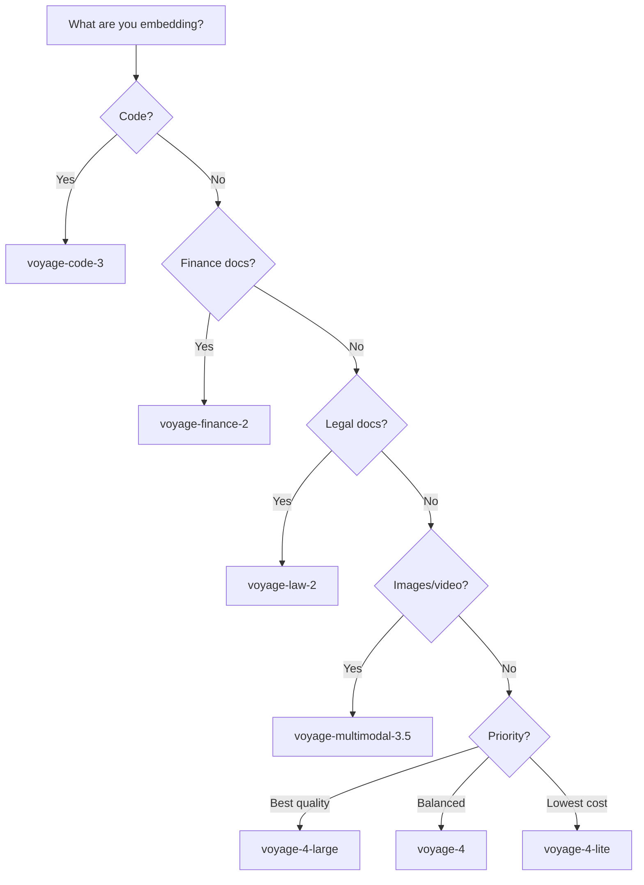

# Choosing a Model

Use this decision guide to select the right Voyage AI model for your use case.

## Quick Decision Tree



## General-Purpose: Voyage 4 Family

| Need | Model | Why |
|------|-------|-----|
| **Best retrieval quality** | `voyage-4-large` | Highest RTEB score (71.41), MoE architecture |
| **Balance quality + cost** | `voyage-4` | Strong quality (70.07) at half the price |
| **Minimize cost** | `voyage-4-lite` | Good quality (68.10) at $0.02/1M |
| **Asymmetric retrieval** | `voyage-4-large` (query) + `voyage-4-lite` (docs) | Best quality queries, cheapest storage |

## Domain-Specific Models

Use these when your content is primarily in one domain — they outperform general-purpose models on domain-specific benchmarks:

- **`voyage-code-3`** — Code, technical documentation, API references
- **`voyage-finance-2`** — Financial reports, SEC filings, earnings calls
- **`voyage-law-2`** — Legal documents, contracts, case law

## Reranking Models

| Need | Model |
|------|-------|
| **Best reranking quality** | `rerank-2.5` |
| **Fast reranking / lower cost** | `rerank-2.5-lite` |

## Cost Comparison

```bash
# Compare costs for your specific workload
vai estimate --docs 500K --queries 2M --months 12

# Compare specific model combinations
vai estimate --doc-model voyage-4-lite --query-model voyage-4-large
```

## Tips

- Start with `voyage-4` (balanced) and benchmark against `voyage-4-large` using `vai eval` — upgrade only if the quality difference matters for your use case.
- Always use reranking in production (`rerank-2.5`). The cost is minimal and the quality improvement is significant.
- Domain-specific models are worth the premium only if your content is primarily in that domain. For mixed content, use general-purpose models.

## Further Reading

- [Models Overview](./overview) — Full model catalog
- [Shared Embedding Space](../core-concepts/shared-embedding-space) — Asymmetric retrieval
- [`vai estimate`](/docs/commands/rag-pipeline/estimate) — Cost estimation
